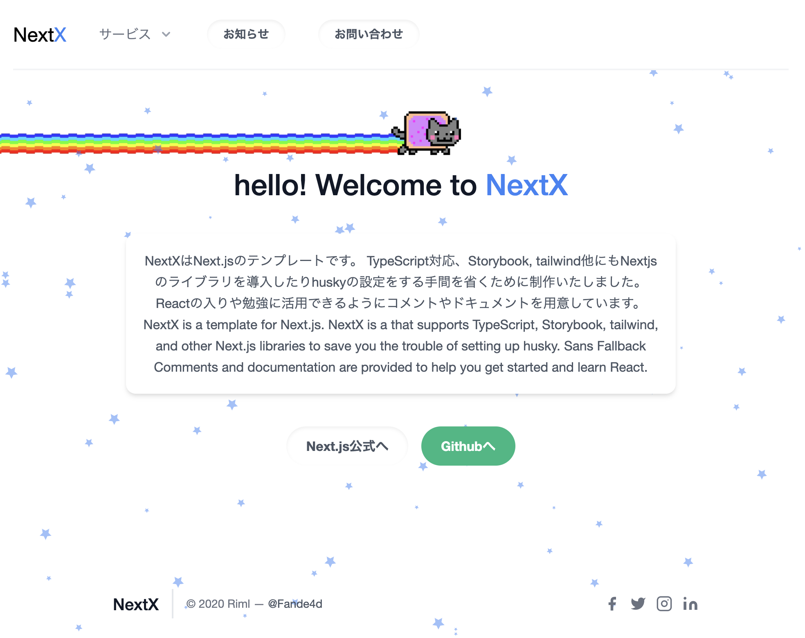

# NextX

[](https://open.vscode.dev/RimlTempest/nextx)



NextX は[Next.js](https://nextjs.org/)のテンプレートです。  

## 導入技術

### Frontend

- Next.js
- TypeScript
- swr

SEO

- [next-seo](Doc/frontend/lib/nextSEO.md)

UI

- [Tailwind](Doc/frontend/UI/tailwind.md)
- [@headlessui/react](Doc/frontend/UI/headlessui.md)
- [Storybook](Doc/frontend/UI/storybook.md)
- [reactTsparticles](Doc/frontend/UI/reactTsparticles.md)

フォーマッター

- [ESLint](Doc/frontend/formatter/eslint.md)
- [Prettier](Doc/frontend/formatter/prettier.md)

Git

- [husky](Doc/frontend/git/husky.md)
- [lint-staged](Doc/frontend/git/lintStaged.md)

### Backend

- [next-connect](Doc/backend/lintStaged.md)

## How to Use

このテンプレートをもとに環境構築

```bash
yarn create next-app --example https://github.com/RimlTempest/nextx
```

## Getting Started

開発モードで起動

```bash
yarn dev
```

ビルド

```bash
yarn build
```

storybook を起動

```bash
yarn storybook
```

storybook のビルド

```bash
yarn build-storybook
```

ESLint を実行

```bash
yarn lint
```

ESLint & Fix を実行

```bash
yarn lint:fix
```

Prettier を実行

```bash
yarn format
```

### Sample

アプリケーションは開発者モードで起動すると  
[http://localhost:3000/](http://localhost:3000/)  
で立ち上がります。

storybook を起動した場合は
[http://localhost:6006/](http://localhost:6006/)  
で立ち上がります。

[API routes](https://nextjs.org/docs/api-routes/introduction)にアクセスするには  
[http://localhost:3000/api/hello](http://localhost:3000/api/hello)  
を get リクエストで query に

```text
?name="すきな文字"&description="好きな文字"
```

を設定し開いてください。

## Learn More

To learn more about Next.js, take a look at the following resources:

- [Next.js Documentation](https://nextjs.org/docs) - learn about Next.js features and API.
- [Learn Next.js](https://nextjs.org/learn) - an interactive Next.js tutorial.

You can check out [the Next.js GitHub repository](https://github.com/vercel/next.js/) - your feedback and contributions are welcome!

## License

MIT License
